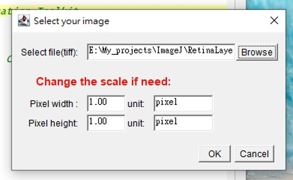
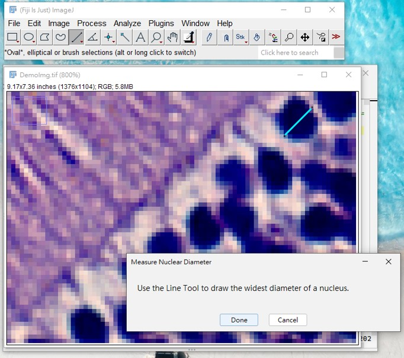
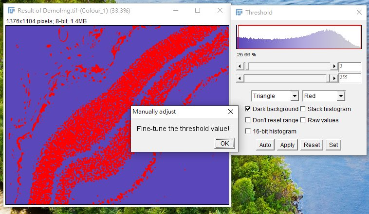
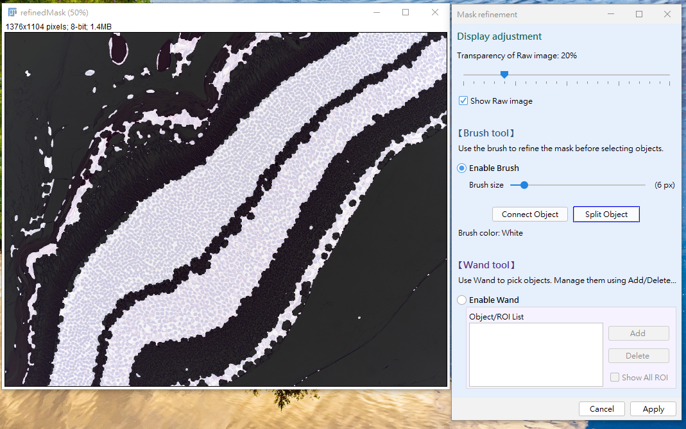

# Retina-layer-Gauge
**RetinaGauge** is an ImageJ tool designed for retina layer thickness measurement. By integrating **boundary restoration** and **automated edge verification**, it overcomes segmentation limitations, complemented by an interactive GUI for anatomical boundary editing and targeted layer measurement.
## Problem & Motivation：
As the extension of the central nervous system, the retina provides valuable structural information for studying neuroinflammation and neurodegenerative disease. Among various structural quantification metrics, layer thickness is one of the most widely used indicators. However, accurate thickness measurement in histological sections remains challenging due to sample damage, discontinuous cellular distributions, and staining artifacts. RetinaGauge was developed to restore anatomically accurate retinal layer boundaries, increasing the reliability of measurements. 
## Method Overview 
RetinaGauge estimates retinal layer thickness by reconstructing anatomically plausible layer boundaries basedon segmentated nuclear mask. The workflow consist of  five major steps:   
1. **Nuclear Mask Extraction**-Extract the nuclear region within the retinal layer.
2. **Mask Reconstruction-Restore** continuous layer boundaries from fragmented structures.
3. **Boundary Review & Region Selection**-Interactively refine reconstructed boundaries and select the target region.
4. **Centerline Analysis**-Extract Centerline and perform normal valdiation and purning.
5. **Thickness Measurement**-Measure the local thickness along the validated centerline and generate quantitative outputs.
  

<em>Figure 1. RetinaGauge workflow for retinal layer thickness measurement.</em>

## Step-by-step demo  
### Step 1: Launch the tool 
1. Open Fiji
2. Go to `Plugins > Macros > Run...`
3. Select `RetinaLayerGauge_architecture_v6_Github.groovy`
4. Run > Run or use Ctrl+R (⌘+R on macOS)
### Step 2: Input image & options  
1.  Select images for each dataset by using <kbd>Browse</kbd> on the pop-out dialog (Fig. 2).
2.  Set the scale factor if need (Fig 2.).

  

  

<em>Figure 2. Dialog for input image.</em>
  

### Step 3: Determine Nuclear size 
1. Draw a line across a repersenttative nuclus to estimate the nuclear diameter(Fig. 3).

  

  <em>Figure 3. Estimation of representative nuclear diameter using the Fiji line tool..</em>

   

   > **Why is this required?**  
   > The measured diameter is used to constrain gap repair and mask reconstruction.
### Step 4: Threshold the image and create mask  
1. You will be asked to confirm the threshold used for nuclear mask generation.

  

  <em>Figure 4. Fine-tune the threshold value for nuclear segmentation.</em>

   

### Step 5: Boundary Review & Editing  
1. Click the `Enable Brush`button to active Brush tool.
   - To connect fragmened boundary use <kbd>Connect Object</kbd>.
   - To split touching objects use <kbd>Split Object</kbd>.
   - Brush size can be adjusted by `Brush size slider`.
   - Adjust raw image transparency for better boundary inspection.

<em>Figure 5. Boundary Review & Editing GUI.</em>

   

### Step 6: Region Selection  
1. Click the `Enable Wand`button to active Wand tool.
   - Software will automatically select whole target object after click target region.
   - Press <kbd>Add</kbd> to add selected object to `ROI list`.
   - To delete object use <kbd>Delete</kbd>.
   - You can go back to Brush mode if object boundary need to be fixed.

## Example Results
## Limitations
## Citation
