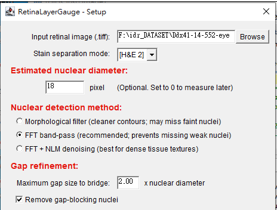
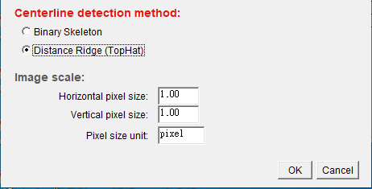
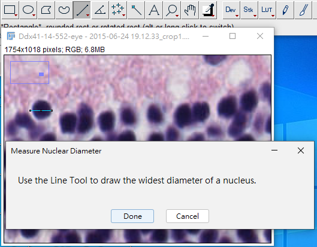
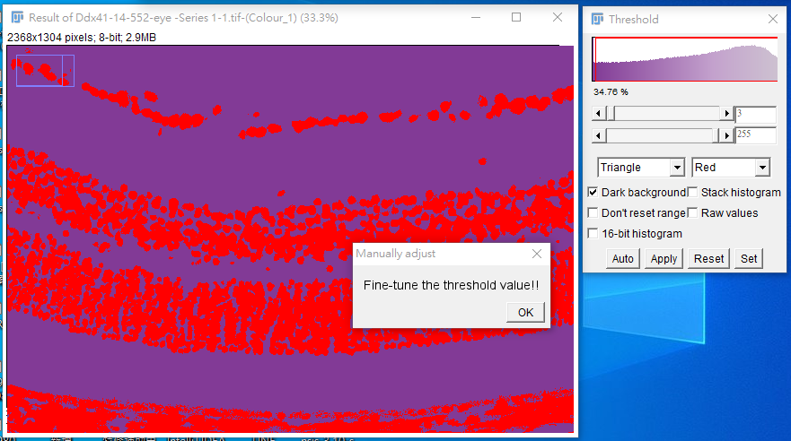
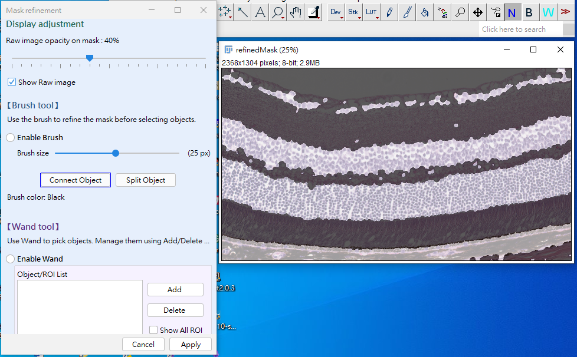
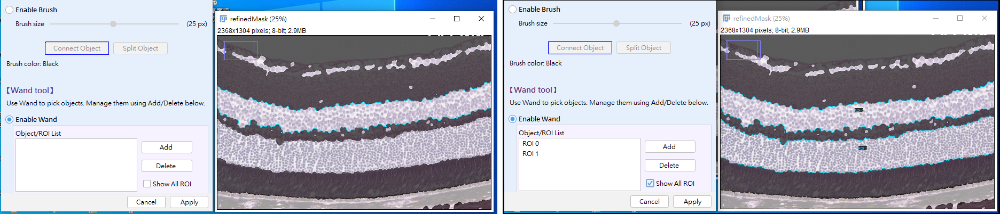
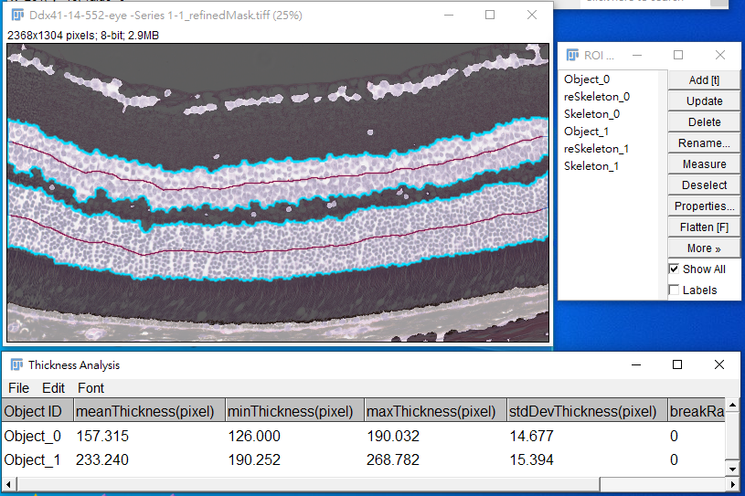

# Retina-layer-Gauge
**RetinaGauge** is an ImageJ tool designed for retina layer thickness measurement. It integrates **boundary restoration** and **automated edge verification** to overcome common segmentation limitations. An interactive GUI further supports anatomical boundary editing and targeted layer measurement.
## Problem & Motivation：
As an extension of the central nervous system, the retina provides valuable structural information for studying neuroinflammation and neurodegenerative diseases. Among various structural quantification metrics, layer thickness is one of the most widely used indicators. However, accurate thickness measurement in histological sections remains challenging due to sample damage, discontinuous cellular distributions, and staining artifacts. RetinaGauge was developed to restore anatomically accurate retinal layer boundaries, increasing the reliability of measurements. 
## Method Overview 
RetinaGauge estimates retinal layer thickness by reconstructing anatomically plausible layer boundaries based on a segmentated nuclear mask. The workflow consists of  five major steps:   
1. **Nuclear Mask Extraction** - Extract the nuclear region within the retinal layer.
2. **Boundary Reconstruction** - Restore continuous retinal boundaries by removing gap-blocking nuclei and reconstructing fragmented structures.
3. **Boundary Review & Region Selection** - Interactively refine reconstructed boundaries and select the target region.
4. **Centerline Extraction** -Extract the centerline using Binary Skeleton or Distance Ridge (TopHat), followed by normal validation and pruning.
5. **Thickness Measurement**-Measure the local thickness along the validated centerline and generate quantitative outputs.
  

<em><b>Figure 1. RetinaGauge workflow for retinal layer thickness measurement.</b></em>

## Step-by-step Demo  
### Step 1: Launch the Tool 
1. Open Fiji
2. Go to `Plugins > Macros > Run...`
3. Select `RetinaLayerGauge_architecture_v6_Github.groovy`
4. Run > Run or use Ctrl+R (⌘+R on macOS)
### Step 2: Input Image & Options  
1.  Select images for each dataset by using <kbd>Browse</kbd> on the pop-up dialog (Fig. 2).
2.  Choose the stain seperation mode according to the input image. 
3.  Enter the estimated nuclear diameter or set it to **0** if you prefer to measure it manually later.
4.  Choose a nuclear dectoin method.
5.  Set the maximum gap size to bridge, expressed as a multiple of the nuclear diameter.
6.  Enable or disable **Gap refinement**.
7.  Select the centerline detection method.
8.  Verify the image scale if necessary.
9.  Click **OK** to contunue.
10.  Set the scale factor if needed (Fig. 2).

| Input and preprocessing settings | Centerline and scale settings |
|---|---|
|  |  |

<em><b>Figure 2. Setup dialog for input image and analysis options.</b></em>
  

### Step 3: Determine Nuclear size 
1. Draw a line across a repersenttative nuclus to estimate the nuclear diameter(Fig. 3).

  

  <em><b>Figure 3. Estimation of representative nuclear diameter using the Fiji line tool..</b></em>

   

   > **Why is this required?**  
   > The measured diameter is used to constrain gap repair and mask reconstruction.
### Step 4: Threshold the image and create mask  
1. You will be asked to confirm the threshold used for nuclear mask generation.

  

  <em><b>Figure 4. Fine-tune the threshold value for nuclear segmentation.</b></em>

   

### Step 5: Boundary Review & Editing  
1. Click the `Enable Brush` button to activate Brush tool.
   - To connect fragmented boundaries use <kbd>Connect Object</kbd>.
   - To split touching objects, use <kbd>Split Object</kbd>.
   - Brush size can be adjusted using `Brush size` slider.
   - Adjust raw image transparency for better boundary inspection.

<em><b>Figure 5. Boundary Review & Editing GUI.</b></em>

   

### Step 6: Region Selection  
1. Click the `Enable Wand` button to activate Wand tool.  
   - Click a target region to automatically select the entire object (Fig. 6-Left).  
   - Press <kbd>Add</kbd> to add the selected object to the `ROI list` (Fig. 6-Right).
   - To remove object from the list, select it and press <kbd>Delete</kbd>.
   - Return to the Brush mode if further boundary refinement is required.
     

<em><b> Figure 6. Region selection workflow using the Wnad tool.</b>   
&nbsp;&nbsp;<b>Left:</b> Select an object by clicking on the target region.&nbsp;&nbsp;<b>Right:</b> Add selected objects to the ROI list for further processing and analysis.
</em>

  

### Step 7: Output Files
- By default, RetinaGauge creates an output folder named after the input image in the same directory as the input image.
- The output folder contains the following files:
  1. **Measurement results (.csv)**
       — Contains thickness statistics and quality metrics for each selected region, including mean, minimum, maximum, standard deviation, coefficient of variation (CV), break rate, and roughness.
  2. **Connected-component labeled image (CCL)**
       — Each selected object is assigned a unique label value for identification and downstream analysis.
  3. **Refined nuclear mask**
       — The refined binary mask generated after boundary correction and object selection.

## Example Results 
After analysis, RetinaGauge displays the Results table and ROI Manager in ImageJ.  
The ROI Manager contains three types of ROIs for each selected region:  
  - Object - Boundary contour of the selected layer.
  - reSkeleton - Refined skeleton used for thickness measurement.
  - Skeleton - Original skeleton before pruning and refinement.

The Results table summarizes thickness statistics and quality metrics for each selected region.

<em><b> Figure 7.Example analysis results generated by RetinaGauge.</b>  
Yellow contours indicate Object Rois. Red cruves represent the refined measurement skeletons (reSkeleton), while blue curves represent the original unpruned skeletons (Skeleton). Thickness statistics are summarized in the Results table.
</em>

  

## Demo Image
The demo image included with RetinaLayerGauge was obtained from the Image Data Resource (IDR), study idr0018: Histopathology of mouse knockouts, Image ID 1919526, and is used under the CC BY 4.0 license. The image is provided as example data for demonstrating the RetinaLayerGauge workflow.

## Citation 
If you use RetinaGauge in your research, please cite this GitHub repository.
